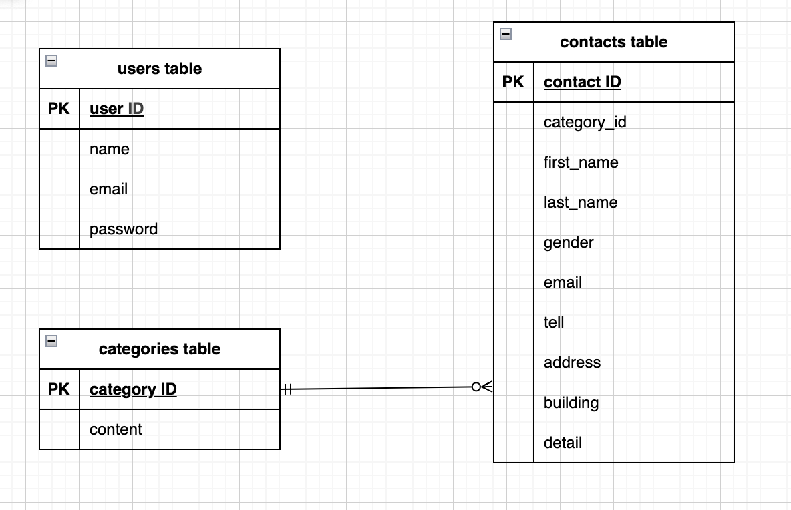

# Fashionably Late

## 環境構築

### Dockerビルド
1. git clone git@github.com:coachtech-material/laravel-docker-template.git
2. mv laravel-docker-template fashionably-late
3. docker-compose up -d --build

### Laravel環境構築
1. docker-compose exec php bash
2. composer install
3. .env.exampleファイルから.envを作成し、環境変数を変更
4. composer require laravel/fortify
5. php artisan migrate
6. composer require laravel-lang/lang:~7.0 --dev
7. php artisan db:seed

## 使用技術
* PHP 7.4.9
* Laravel 8.83.8
* MySQL 8.0.26

## ER図

## URL
* 開発環境：[http://localhost/](http://localhost/)
* phpMyadmin：[http://localhost:8080/](http://localhost:8080/)
